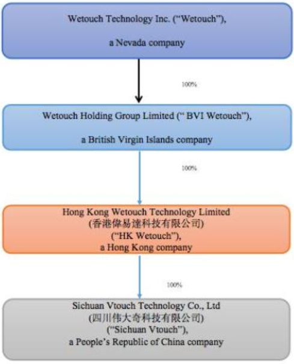

# Equity report on Wetouch Technology (WETH)
Wetouch Technology is NASDASQ listed (ticker WETH) company[^1] trading at 20% of cash, PE of 4 and $-85M enterprise value.

Is this deep fucking value or a value trap?

[^1]:https://www.sec.gov/edgar/browse/?CIK=1826660

## Introduction
Wetouch  Technology Inc. ("Wetouch") is involved in the development, manufacturing, sales and servicing of medium to large projected capacitive touchscreens.
The company is fully located in Chengdu, China with foreign holding companies to facilitate listing in a US stock exchange. Domestic sales make up about 69% of revenue.

## Corporate Structure
Due to recent liberalisation[^2] in the foreign ownership of companies incorporated in the People's Republic of China ("PRC"), Wetouch __does not__ feature the troubled variable interest entity ("VIE") which was common in the past for foreign listed PRC companies.

Instead, the PRC company is fully owned by the Nevada company through two other shell companies:[^3]
* Wetouch Technology Inc. (Nevada incorporated, NASDASQ listed)
    * Wetouch Holding Group Limited (British Virgin Islands incorporated, fully owned subsidiary)
        * Hong Kong Wetouch Technology Limited (Hong Kong incorporated, fully owned subsidiary)
            * Sichuan Vtouch Technology Co., Ltd. (PRC incorporated, fully owned subsidiary)

[^3]

### Related parties
Chengdu Wetouch Intelligent Optoelectronics Co., Ltd. ("Chengdu Wetouch") is a separate supplier which is fully owned by Ms. Jiyaing Cai, director of Wetouch.[^3] [^4]

Ms. Jiyaing Cai also owns 68% of Chengdu Frejoo Enterprise Management Co., Ltd.[^3] [^4]

Ms. Jiyaing Cai has in previous occasion used Chengdu Wetouch to finance the activities of Wetouch, leading to shared financial liabilities.[^3] [^4]

[^2]:https://english.beijing.gov.cn/investinginbeijing/WhyBeijing/Environment/bus_env_policy/bizenv_starting/202410/t20241009_3914897.html
[^3]:https://www.sec.gov/ix?doc=/Archives/edgar/data/0001826660/000149315224014934/form10-k.htm

## Balance sheet
| Quarter                           | 3Q2024 (unaudited)[^4]  | 2Q2024 (unaudited)[^5]  |
|:----------------------------------|:-------------------:|:-------------------:|
| Cash and short term investments   | $106.7M             | $98.4M              |
| Total Receivables                 | $9.8M               | $10.8M              |
| Other current assets              | $3.4M               | $3.4M               |
| Total current assets              | $120M               | $113.2M             |
| Net Property Plant and Equipment  | $13.1M              | $12.7M              |
| Total Assets                      | $133.1M             | $133.1M             |
| Total Liabilities                 | $3.7M               | $3.4M               |
| Common Equity                     | $129.5M             | $129.5M             |
| Diluted shares outstanding        | 11.9M               | 11.9M               |

$40 million was raised from private issue at $0.25 a share on March 18th, 2023. $1.2 million in fees.

$9.2 million raised from public offering in February 20th, 2024 at $5 per share.

Up to $15 million worth of stock buyback has been approved for between $1 and $4 a share up until July 2025.

[^4]:https://www.sec.gov/ix?doc=/Archives/edgar/data/0001826660/000121390024098428/ea0221068-10q_wetouch.htm
[^5]:https://www.sec.gov/ix?doc=/Archives/edgar/data/0001826660/000121390024070737/ea0211701-10q_wetouch.htm

## Income statement
| Quarter                           | 3Q2024 (unaudited)[^4]  | 2Q2024 (unaudited)[^5]  |
|:----------------------------------|:-------------------:|:-------------------:|
| Total Revenues                    | $11.5M              | $12.2M              |
| Cost of Revenues                  | $7.1M               | $7.4M               |
| Gross Profit                      | $4.4M               | $4.9M               |
| Selling General & Admin Expenses  | $0.9M               | $1.1M               |
| R&D Expenses                      | $0.0M               | $0.0M               |
| Operating Income                  | $3.5M               | $3.7M               |
| Interest Expenses                 | $0.0M               | $0.0M               |
| Interest and Investment Income    | $0.0M               | $0.0M               |
| Net Income                        | $2.7M               | $2.7M               |

## Unusual risk factors
The current market cap of the company is less than $20 million, despite it holding over $100 million in cash and less than $5 million in liabilities.

I believe this discrepancy is partly due to the fact their previous auditor (BF Borgers CPA PC) is being sued by the SEC for fraud and their current auditor (Enrome LLP, starting May 10th, 2024) has not yet been able to fully audit their books.

They've also repeatedly filed their quarterly and annual SEC reports late and have had similar issues with late filings in China.
Wetouch has been sued several times for failure to pay suppliers and debtors, including a case where they defaulted on a $8.5 million loan, leading to $1.7 million in penalties.

On June 3rd, 2024 three members of the board resigned with no reason given.
They have since been replaced.

The July 8th, 2024 appointment of Ms.Xing Tang as CFO should rectify some of these issues, particularly when it comes to SEC fillings due to hist past experience.
She has previous experience with 2 US listed companies (Elong Power Holdings Limited and China XD Plastics Co., Ltd).
The stock price of both of these companies has crashed for unclear reasons in the past few years.

## Business operations
Revenue comes from manufacturing and selling touchscreens in several locations in mainland China.

Six customers made up more than 10% of revenue in 2023:
1. Siemens Industrial Automation products (Chengdu) Co., Ltd. -- 22.5%
2. Shangai Sigang Electronics Co., Ltd -- 16.5%
3. E-Lead Electronic Co. Ltd. -- 15.7%
4. MultimediaLink Inc. -- 14.1%
5. Suzhou Weinview Co., Ltd -- 11.3%

Total of top 5 customers: 80.1%

## Intellectual property
The company has applied for several patents in China which we were able to confirm.[^6] [^7]

We were unable to confirm its claimed trademark in PRC.

[^6]:https://patentscope.wipo.int/search/en/detail.jsf?docId=CN338538735&_cid=P22-M594GD-96090-1

[^7]:https://patentscope.wipo.int/search/en/detail.jsf?docId=CN396416361&_cid=P22-M594IA-96454-1

## Locations
Their main location was subject to government directed relocation in 2021, leading to a $16.4 million compensation and an agreement to lease another facility for $57 thousand a month.

They've committed capital to a new facility  in Chengdu Medicine City (Technology Park) and expected completion of the building by first quarter of 2025 and start of production there by the third quarter of 2025.
